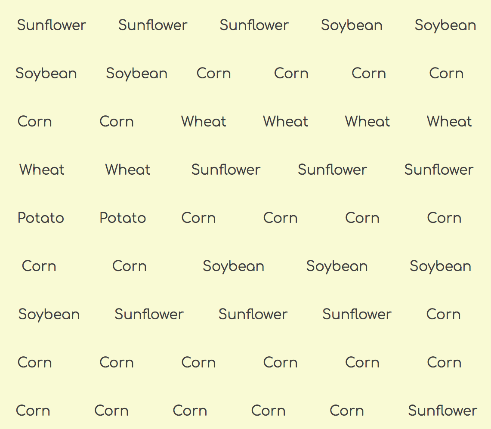
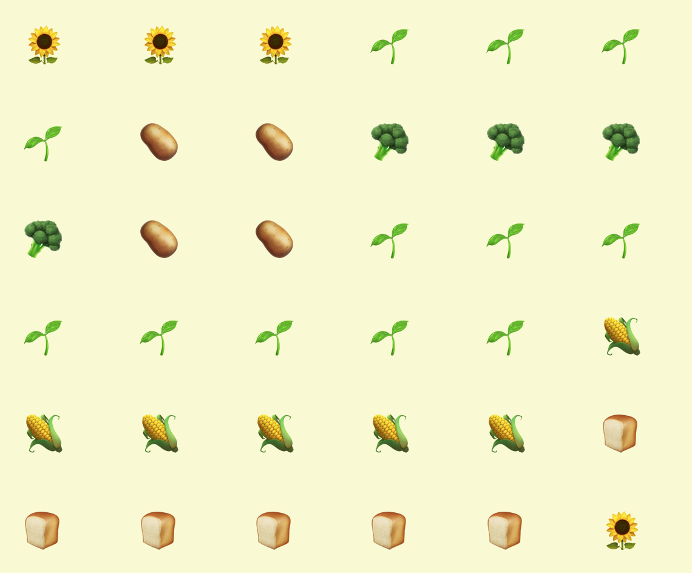

# Modern Farm Management

In this project, you will be practicing the following skills.

1. Declaring variables with `let` and `const`.
1. Writing functions.
1. Function parameters and arguments.
1. Iteration with `for` loops and/or `forEach` array methods.
1. Modular development to enforce the Single Responsibiity Principle to your code.
1. Using `import` and `export` keywords between modules.
1. Conditional logic using `if` and `else`.

## Creating a Harvest Plan

There is an existing `plan.js` module in this application that is reponsible for defining 3 rows of crops to be planted. In each row, there are 6 plots of land. Each plot is randomly assigned one of the following types of food to grow.

1. Corn
1. Asparagus
1. Potato
1. Wheat
1. Sunflower
1. Soybean

Examine the `scripts/plan.js` module. Then, in the `scripts/main.js` module, execute the proper function to generate the plan. Store the output of that function into a variable named `yearlyPlan`.

Remember that to assign what a function returns as a value of a variable, the syntax is...

```js
const appropriatelyNamedVariable = theFunctionThatReturnsAValue()
```

Then use `console.log()` to output the value of `yearlyPlan` to the developer console in Chrome.

## Seed Producing Modules

1. Create a `scripts/seeds` directory. The `scripts` directory already exists, so create the `seeds` sub-directory in it.
1. Create a module for each type of possible plant in the `seeds` directory. For example, one of the types of food you grow is corn. Create a `scripts/seeds/corn.js` module. Make sure that each file uses all lowercase letters for the file name.
1. In each module define and export a function for creating a seed. Define the functions with the following syntax. If the plant is Asparagus, the function should be named `createAsparagus`. Same thing for all the others. Use arrow functions. Do not use the `function` keyword.
1. Each of these functions should return an object with the following properties. Look at the table below the instructions to see what the values for each object are.
    1. `type`
    1. `height`
    1. `output`
1. The one exception is corn. The `createCorn` function should return an array with two identical objects in it. Each with the proper keys and values.

### Plant Properties Table

| Plant | Height | Output |
|--|--|--|
| Soybean | 20 | 4 |
| Corn | 180 | 6 |
| Sunflower | 380 | 3 |
| Asparagus | 24 | 4 |
| Wheat | 230 | 6 |
| Potato | 32 | 2 |

## Tilling the Field

1. Create a `scripts/field.js` module.
1. In the module, define and export a function named `addPlant`.
1. The `addPlant` function must accept a seed object as input.
1. Define a variable in this module whose initial value is an empty array. This array will store all of the plants that are growing in the field.
1. Define and export a function named `usePlants` that returns a copy of the array of plants.
1. Be aware that when planting corn, an array of objects will be provided instead of a single object like all the other type of seeds. Investigate the [Array.isArray](https://www.geeksforgeeks.org/javascript-array-isarray-function/) method to check if corn got passed in, or one of the others.

## Sowing the Field With Your Tractor

1. Create a `scripts/tractor.js` module.
1. In this module, define and export a `plantSeeds` function.
1. The function must accept the year's planting plan as input _(i.e. it must define a parameter)_.
1. The plan is an array. It contains 4 arrays representing the rows in the field to be plants. Figure out how to iterate both the parent array and the child arrays.
1. As you iterate the row of food types to be planted, invoke the corresponding factory function _(e.g. if the food type is "Asparagus", invoke the `createAsparagus` function to get an asparagus seed)_.
1. Take that seed and add it to the array of plants in the field module.

#### Checking Your Logic

In the `main.js` module, get all of the seeds planted with the function defined in this module.

## Collecting the Harvest

1. Create a `scripts/harvester.js` module.
1. In this module, define and export a `harvestPlants` function.
1. The `harvestPlants` function must accept the plants array as input.
1. The function will return an array of seed objects.
1. Iterate the array of growing plants. On each plant, get the value of the `output` property.
1. Add that many of the plant objects to the array that the function returns. For example, if the current plant is a peanut object with an output of 2...
    ```js
    {
        type: "Peanut",
        height: 30,
        output: 2
    }
    ```
    Then the array that the function returns should have two identical objects added to it.
    ```js
    [
        {
            type: "Peanut",
            height: 30,
            output: 2
        },
        {
            type: "Peanut",
            height: 30,
            output: 2
        }
    ]
    ```
1. Again, the exception is corn. Half of your corn will be sold to cattle ranchers, so only half of the output of each corn plant will be added to the array that this function returns.

#### Checking Your Logic

In the `main.js` module, get the array of plants from the field, and then harvest them by invoking the appropriate function. Make sure you specify the array of plants as an argument to the harvesting function.

## Selling the Harvest Online

You are a modern farm, so you want to put everything that you harvested on your farm's ordering web site so that buyers can access it from anywhere. To start, just list each of the plants in your harvest.

Use Flexbox to make a grid layout like below.




## Optional Challenge: Ordering the harvest

> **Note:** Optional challenges are exactly that, optional. Your instructors will not expect that you have any of it done. It is for your own learning, curiosity and exploration.

Your first optional challenge is to display the list of food to be sold in alphabetical order. That is, all corn should be listed first, then all potatoes, then soybean, sunflower and wheat.

## Optional Challenge: Emoji Food

Add an `icon` property to each of your seed objects so that the user can see a picture of the food.



## Optional Challenge: Display once with quantity

Instead of displaying all object individually, show only one HTML representation of each plant type and display the quantity that you are selling of that type.

## Optional Challenge: Unique identifiers

Add a unique, incrementing `id` property to each harvested plant. The first plant harvested should have an `id` value of 1. The second one should have a value of 2, etc.


